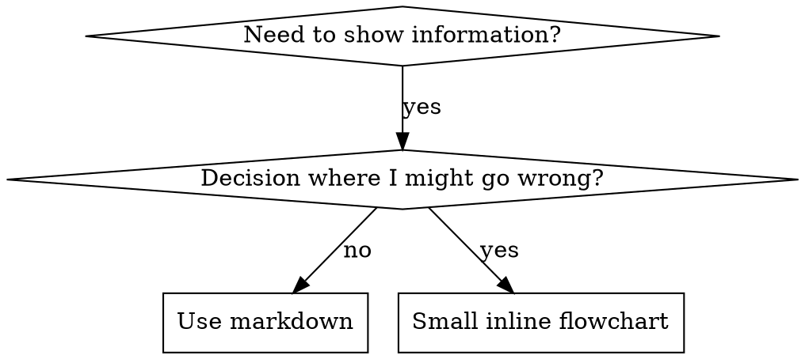

# Writing skills

## Overview

**Writing skills IS Test-Driven Development applied to process documentation.**

**Personal skills live in agent-specific directories (`~/.claude/skills` for Claude Code, `~/.agents/skills/` for Codex).**

You write test cases (pressure scenarios with subagents), watch them fail (baseline behavior), write the skill (documentation), watch tests pass (agents comply), and refactor (close loopholes).

**Core principle:** If you didn't watch an agent fail without the skill, you don't know if the skill teaches the right thing.

**REQUIRED BACKGROUND:** You MUST understand supapowers:test-driven-development before using this skill. That skill defines the fundamental RED-GREEN-REFACTOR cycle. This skill adapts TDD to documentation.

**Official guidance:** For Anthropic's official skill authoring best practices, see `references/anthropic-best-practices.md`.

## What is a skill?

A **skill** is a reference guide for proven techniques, patterns, or tools. Skills help future Claude instances find and apply effective approaches.

**Skills are:** Reusable techniques, patterns, tools, reference guides

**Skills are NOT:** Narratives about how you solved a problem once

## TDD mapping for skills

| TDD Concept | Skill Creation |
| ------------- | ---------------- |
| **Test case** | Pressure scenario with subagent |
| **Production code** | Skill document (SKILL.md) |
| **Test fails (RED)** | Agent violates rule without skill (baseline) |
| **Test passes (GREEN)** | Agent complies with skill present |
| **Refactor** | Close loopholes while maintaining compliance |
| **Write test first** | Run baseline scenario BEFORE writing skill |
| **Watch it fail** | Document exact rationalizations agent uses |
| **Minimal code** | Write skill addressing those specific violations |
| **Watch it pass** | Verify agent now complies |
| **Refactor cycle** | Find new rationalizations, plug, re-verify |

The entire skill creation process follows RED-GREEN-REFACTOR.

## When to create a skill

**Create when:**

- Technique wasn't intuitively clear to you
- You'd reference this again across projects
- Pattern applies broadly (not project-specific)
- Others would benefit

**Don't create for:**

- One-off solutions
- Standard practices well-documented elsewhere
- Project-specific conventions (put in CLAUDE.md)
- Mechanical constraints (if it's enforceable with regex/validation, automate it)

## Skill types

### Technique

Concrete method with steps to follow (condition-based-waiting, root-cause-tracing)

### Pattern

Way of thinking about problems (flatten-with-flags, test-invariants)

### Reference

API docs, syntax guides, tool documentation (office docs)

## Directory structure

```text
skills/
  skill-name/
    SKILL.md              # Main reference (required)
    agents/               # Agent definitions
    references/           # Supporting reference docs
    scripts/              # Executable utilities
    assets/               # Examples, templates, static files
    eval/                 # Evaluation scenarios
```

**Flat namespace** - all skills in one searchable namespace.

**Separate files for:**

1. **Heavy reference** (100+ lines) - API docs, comprehensive syntax
2. **Reusable tools** - Scripts, utilities, templates

**Keep inline:**

- Principles and concepts
- Code patterns (< 50 lines)
- Everything else

## SKILL.md structure

**Frontmatter (YAML):**

- Only two fields supported: `name` and `description`
- Max 1024 characters total
- `name`: Use letters, numbers, and hyphens only (no parentheses, special chars)
- `description`: Third-person, describes ONLY when to use (NOT what it does)
  - Start with "Use when..." to focus on triggering conditions
  - Include specific symptoms, situations, and contexts
  - **NEVER summarize the skill's process or workflow** (see CSO section for why)
  - Keep under 500 characters if possible

```markdown
---
description: Use when [specific triggering conditions and symptoms]
name: Skill-Name-With-Hyphens
---

# Skill name

## Overview

What is this? Core principle in 1-2 sentences.

## When to use

[Small inline flowchart IF decision non-obvious]

Bullet list with SYMPTOMS and use cases
When NOT to use

## Core pattern (for techniques/patterns)

Before/after code comparison

## Quick reference

Table or bullets for scanning common operations

## Implementation

Inline code for simple patterns
Link to file for heavy reference or reusable tools

## Common mistakes

What goes wrong + fixes

## Real-World impact (optional)

Concrete results
```

## Claude search optimization (CSO)

**Critical for discovery:** Future Claude needs to FIND your skill.

### Rich description field

**Purpose:** Claude reads description to decide which skills to load. Make it answer: "Should I read this skill right now?"

**CRITICAL: Description = When to Use, NOT What the Skill Does**

The description should ONLY describe triggering conditions. Do NOT summarize the skill's process or workflow in the description.

**Why this matters:** Testing revealed that when a description summarizes the skill's workflow, Claude may follow the description instead of reading the full skill content. A description saying "code review between tasks" caused Claude to do ONE review, even though the skill's flowchart clearly showed TWO reviews. When the description was changed to only triggering conditions, Claude correctly read the flowchart and followed the full process.

**The trap:** Descriptions that summarize workflow create a shortcut Claude will take. The skill body becomes documentation Claude skips.

```yaml
# BAD: Summarizes workflow
description: Use when executing plans - dispatches subagent per task with code review between tasks

# GOOD: Just triggering conditions
description: Use when executing implementation plans with independent tasks in the current session
```

**Content rules:**

- Use concrete triggers, symptoms, and situations
- Describe the *problem* not *language-specific symptoms*
- Keep triggers technology-agnostic unless skill is technology-specific
- Write in third person (injected into system prompt)
- **NEVER summarize the skill's process or workflow**

### Keyword coverage

Use words Claude would search for:

- Error messages: "Hook timed out", "ENOTEMPTY", "race condition"
- Symptoms: "flaky", "hanging", "zombie", "pollution"
- Synonyms: "timeout/hang/freeze", "cleanup/teardown/afterEach"
- Tools: Actual commands, library names, file types

### Descriptive naming

**Use active voice, verb-first:**

- `creating-skills` not `skill-creation`
- `condition-based-waiting` not `async-test-helpers`

**Gerunds (-ing) work well for processes:**

- `creating-skills`, `testing-skills`, `debugging-with-logs`

### Token efficiency (Critical)

**Problem:** frequently-referenced skills load into EVERY conversation. Every token counts.

**Target word counts:**

- getting-started workflows: <150 words each
- Frequently-loaded skills: <200 words total
- Other skills: <500 words (still be concise)

**Techniques:** Reference `--help` instead of documenting all flags inline. Use cross-references (`REQUIRED: Use [other-skill-name]`) instead of repeating workflow details. Eliminate redundant examples.

### Cross-Referencing other skills

Use skill name only, with explicit requirement markers:

- `**REQUIRED SUB-SKILL:** Use supapowers:test-driven-development`
- `**REQUIRED BACKGROUND:** You MUST understand supapowers:systematic-debugging`

**Why no @ links:** `@` syntax force-loads files immediately, consuming context before you need it.

## Flowchart usage



**Use flowcharts ONLY for:**

- Non-trivial decision points
- Process loops where you might stop too early
- "When to use A vs B" decisions

**Never use flowcharts for:**

- Reference material (use tables, lists)
- Code examples (use markdown blocks)
- Linear instructions (use numbered lists)
- Labels without semantic meaning (step1, helper2)

See `references/graphviz-conventions.dot` for graphviz style rules.

**Visualizing for your human partner:** Use `scripts/render-graphs.js` to render a skill's flowcharts to SVG:

```bash
./scripts/render-graphs.js ../some-skill           # Each diagram separately
./scripts/render-graphs.js ../some-skill --combine # All diagrams in one SVG
```

## Code examples

**One excellent example beats many mediocre ones.**

Choose most relevant language:

- Testing techniques: TypeScript/JavaScript
- System debugging: Shell/Python
- Data processing: Python

**Good example:**

- Complete and runnable
- Well-commented explaining WHY
- From real scenario
- Shows pattern clearly
- Ready to adapt (not generic template)

**Don't:**

- Implement in 5+ languages
- Create fill-in-the-blank templates
- Write contrived examples

## The iron law (Same as TDD)

```text
NO SKILL WITHOUT A FAILING TEST FIRST
```

This applies to NEW skills AND EDITS to existing skills.

Write skill before testing? Delete it. Start over.
Edit skill without testing? Same violation.

**No exceptions:**

- Not for "minor additions"
- Not for "adding a section"
- Not for "documentation updates"
- Don't keep untested changes as "reference"
- Don't "adapt" while running tests
- Delete means delete

**REQUIRED BACKGROUND:** The supapowers:test-driven-development skill explains why this matters. Same principles apply to documentation.

## Testing all skill types

Different skill types need different test approaches:

| Skill Type | Test With | Success Criteria |
| ------------ | ----------- | ----------------- |
| **Discipline** (TDD, verification) | Pressure scenarios with 3+ combined pressures | Agent follows rule under maximum pressure |
| **Technique** (how-to guides) | Application + variation + missing-info scenarios | Agent successfully applies technique to new scenario |
| **Pattern** (mental models) | Recognition + application + counter-examples | Agent correctly identifies when/how to apply pattern |
| **Reference** (docs/APIs) | Retrieval + application + gap testing | Agent finds and correctly applies reference information |

Full testing methodology: `references/testing-skills-with-subagents.md`.

## Common rationalizations for skipping testing

| Excuse | Reality |
| -------- | --------- |
| "Skill is clearly written" | Clear to you does not equal clear to other agents. Test it. |
| "It's only a reference" | References can have gaps, unclear sections. Test retrieval. |
| "Testing is overkill" | Untested skills have issues. Always. 15 min testing saves hours. |
| "I'll test if problems emerge" | Problems = agents can't use skill. Test BEFORE deploying. |
| "Too tedious to test" | Testing is less tedious than debugging bad skill in production. |
| "I'm confident it's good" | Overconfidence guarantees issues. Test anyway. |
| "Academic review is enough" | Reading does not equal using. Test application scenarios. |
| "No time to test" | Deploying untested skill wastes more time fixing it later. |

**All of these mean: Test before deploying. No exceptions.**

## Bulletproofing skills against rationalization

Skills that enforce discipline need to resist rationalization. Agents are smart and will find loopholes under pressure. See `references/persuasion-principles.md` for research foundation (Cialdini, 2021; Meincke et al., 2025).

**Four techniques:**

1. **Close every loophole explicitly** - State the rule AND list specific forbidden workarounds ("Don't keep as reference", "Don't adapt", "Delete means delete").
2. **Add foundational principle** - "Violating the letter of the rules is violating the spirit of the rules." This cuts off entire classes of rationalization.
3. **Build rationalization table** - Every excuse observed in baseline testing goes in the table with an explicit counter. See the table in `references/testing-skills-with-subagents.md`.
4. **Create red flags list** - List symptoms of imminent violation: "I already manually tested it", "This is different because...", "I'm following the spirit not the letter".

## RED-GREEN-REFACTOR for skills

### RED: write failing test (Baseline)

Run pressure scenario with subagent WITHOUT the skill. Document exact behavior:

- What choices did they make?
- What rationalizations did they use (verbatim)?
- Which pressures triggered violations?

This is "watch the test fail" - you must see what agents naturally do before writing the skill.

### GREEN: write minimal skill

Write skill that addresses those specific rationalizations. Don't add extra content for hypothetical cases.

Run same scenarios WITH skill. Agent should now comply.

### REFACTOR: close loopholes

Agent found new rationalization? Add explicit counter. Re-test until bulletproof.

**Full testing methodology:** `references/testing-skills-with-subagents.md`

## Anti-Patterns

| Pattern | Example | Why bad |
| --------- | --------- | --------- |
| Narrative | "In session 2025-10-03, we found..." | Too specific, not reusable |
| Multi-language dilution | example-js.js, example-py.py | Mediocre quality, maintenance burden |
| Code in flowcharts | `step1 [label="import fs"]` | Cannot copy-paste, hard to read |
| Generic labels | helper1, step3, pattern4 | Labels should have semantic meaning |

## STOP: before moving to next skill

**After writing ANY skill, you MUST STOP and complete the deployment process.** Do not create multiple skills in batch without testing each. Deploying untested skills = deploying untested code.

## Skill creation checklist (TDD adapted)

**IMPORTANT: Use TodoWrite to create todos for EACH checklist item below.**

**RED Phase - Write Failing Test:**

- [ ] Create pressure scenarios (3+ combined pressures for discipline skills)
- [ ] Run scenarios WITHOUT skill - document baseline behavior verbatim
- [ ] Identify patterns in rationalizations/failures

**GREEN Phase - Write Minimal Skill:**

- [ ] Name uses only letters, numbers, hyphens (no parentheses/special chars)
- [ ] YAML frontmatter with only name and description (max 1024 chars)
- [ ] Description starts with "Use when..." and includes specific triggers/symptoms
- [ ] Description written in third person
- [ ] Keywords throughout for search (errors, symptoms, tools)
- [ ] Clear overview with core principle
- [ ] Address specific baseline failures identified in RED
- [ ] Code inline OR link to separate file
- [ ] One excellent example (not multi-language)
- [ ] Run scenarios WITH skill - verify agents now comply

**REFACTOR Phase - Close Loopholes:**

- [ ] Identify NEW rationalizations from testing
- [ ] Add explicit counters (if discipline skill)
- [ ] Build rationalization table from all test iterations
- [ ] Create red flags list
- [ ] Re-test until bulletproof

**Quality Checks:**

- [ ] Small flowchart only if decision is non-trivial
- [ ] Quick reference table
- [ ] Common mistakes section
- [ ] No narrative storytelling
- [ ] Supporting files only for tools or heavy reference

**Deployment:**

- [ ] Commit skill to git and push to your fork (if configured)
- [ ] Consider contributing back via PR (if broadly useful)

## Discovery workflow

How future Claude finds your skill:

1. **Encounters problem** ("tests are flaky")
2. **Finds SKILL** (description matches)
3. **Scans overview** (is this relevant?)
4. **Reads patterns** (quick reference table)
5. **Loads example** (only when implementing)

**Optimize for this flow** - put searchable terms early and often.

## Reference and script index

### References (`references/`)

| File | Description |
| ------ | ------------- |
| `anthropic-best-practices.md` | Anthropic official skill authoring best practices |
| `testing-skills-with-subagents.md` | Complete RED-GREEN-REFACTOR testing methodology |
| `persuasion-principles.md` | Research-backed persuasion principles for discipline skills |
| `graphviz-conventions.dot` | Style conventions for Graphviz diagrams |
| `fetch-references.md` | Index of fetchable reference sources |

### Scripts (`scripts/`)

| File | Description |
| ------ | ------------- |
| `render-graphs.js` | Render skill flowcharts to SVG |
| `fetch_resources.py` | Fetch updated reference docs from official sources |

### Agents (`agents/`)

| File | Description |
| ------ | ------------- |
| `writing-skills-agent.md` | Primary agent for creating skills using TDD methodology |

### Assets (`assets/`)

| File | Description |
| ------ | ------------- |
| `examples/CLAUDE_MD_TESTING.md` | Full test campaign example for CLAUDE.md documentation |

## The bottom line

**Creating skills IS TDD for process documentation.**

Same Iron Law: No skill without failing test first.
Same cycle: RED (baseline) -> GREEN (write skill) -> REFACTOR (close loopholes).
Same benefits: Better quality, fewer surprises, bulletproof results.

If you follow TDD for code, follow it for skills. It is the same discipline applied to documentation.
